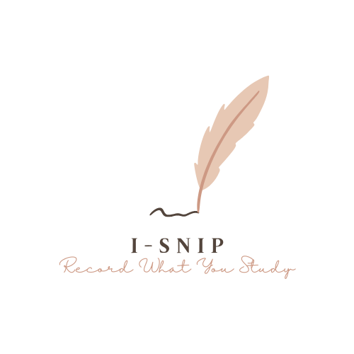

  
   
   

Version 2 API build with Fiber, it is still under development at present.

> Gin verision is in [v1 branch](https://github.com/Grey0520/isnip_api/tree/v1), contains the complete available program code.

前端地址：https://yequ.coding.net/public/xb/isnip_frontend/git/files
